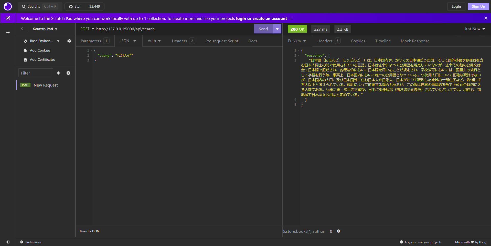

# Japanese Wiki Search Engine
Authors:
- Github: [ktoan911](https://github.com/ktoan911) 
- Email: khanhtoan.forwork@gmail.com 


This project is a Japanese Wiki Search Engine designed to retrieve information from Japanese language Wikipedia articles efficiently. It utilizes a combination of indexing, querying, and ranking algorithms to provide relevant results to user queries.


## Architecture Image


## I.  Set up environment
- Step 1: create a Conda environment named your_env_name with Python version  3.11.3

```python
conda create -n ${your_env_name} python= 3.11.3
```

- Step 2: Activate the newly created environment using the following command
```
conda activate ${your_env_name}
```

- Step 3: Install Packages from requirements.txt

```
pip install -r requirements.txt
``` 

## II.  Set up your dataset

This project utilized [fujikillm-japanese-dataset_wikipedia](https://huggingface.co/datasets/fujiki/llm-japanese-dataset_wikipedia?row=16)
```
from datasets import load_dataset

dataset = load_dataset("fujiki/llm-japanese-dataset_wikipedia")
```
- We use `dataset['train']['output']` as a wiki docs.
- We use Mecab for tokenizing text by breaking it down into individual words or tokens. Using the -Owakati option, MeCab outputs the text with words separated by spaces for easy further analysis.

## III.  Architecture
### 1. Raw Search (TF-IDF):

The initial query is processed using a coarse-grained search mechanism based on Term Frequency-Inverse Document Frequency (TF-IDF). To improve query speed, we have saved the TF-IDF scores of the words in the paragraphs as well as the penalty `ds` scores in the formula below.


The k texts with the highest scores will be selected.

### 2. Similarity Calculation (Cosine Similarity):
- We use [sentence-luke-japanese-base-lite](https://huggingface.co/sonoisa/sentence-luke-japanese-base-lite) model to embed the texts .
- In this project we useFAISS (Facebook AI Similarity Search) to effectively search for similar database vectors with high speed and accuracy. We use the cosine method to calculate similarity scores.

## IV. Demo



In this case, the query speed is 1.5s


